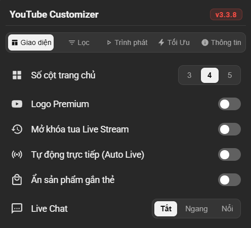

<div align="center">

# YouTube Customizer

**Userscript tùy biến giao diện YouTube, tối ưu hiệu năng và điều khiển video thông minh**

[](https://www.tampermonkey.net/)
[](https://developer.mozilla.org/en-US/docs/Web/JavaScript)
[](https://www.w3.org/Style/CSS/)
[](https://github.com/huyvu2512/youtube-customizer)
[](./LICENSE)

[](https://github.com/huyvu2512/youtube-customizer/stargazers)
[](https://github.com/huyvu2512/youtube-customizer/forks)
[](https://github.com/huyvu2512/youtube-customizer/issues)
[](https://github.com/huyvu2512/youtube-customizer/commits/main)


[Cài Đặt Script](https://raw.githubusercontent.com/huyvu2512/youtube-customizer/main/tampermonkey.user.js) · [Báo Lỗi](https://github.com/huyvu2512/youtube-customizer/issues) · [Yêu Cầu Tính Năng](https://github.com/huyvu2512/youtube-customizer/issues)

</div>

---

<div align="center">
  
</div>

---

## Giới thiệu

**YouTube Customizer** là tiện ích mở rộng dạng Userscript chạy trên nền Tampermonkey / Violentmonkey, được thiết kế nhằm mang lại trải nghiệm xem YouTube gọn gàng, mượt mà và trực quan hơn. Sản phẩm được thiết kế và phát triển bởi Huy Vũ (@huyvu2512) với mục tiêu nghiên cứu chuyên sâu về cơ chế can thiệp DOM (DOM Manipulation), tối ưu hóa hiệu năng render trình phát và điều khiển tương tác trên nền tảng YouTube.

Phiên bản **v3.5.6** nâng cấp toàn diện tính năng **Kiểm tra cập nhật**: tự động mở ngay trang cài đặt Tampermonkey khi có bản mới, đếm ngược 10s tự động F5 kèm cơ chế **Smart Return Reload** (tự động F5 tức thì khi người dùng cập nhật xong và quay lại tab YouTube), đồng thời chuẩn hóa nhãn hiển thị thành **"Đã cập nhật"** khi đang ở bản mới nhất. Toàn bộ tính năng hiện có được bảo toàn nguyên vẹn 100%.

---

## Tính năng chính

- **Menu cài đặt 5 Tab trực quan** - Phân chia khoa học thành Giao diện, Lọc nội dung, Trình phát, Tối Ưu và Thông tin tiện ích với giao diện Dark Mode bán trong suốt tinh tế.
- **Tối ưu hiệu năng Zero-Lag & Bố cục lưới mượt mà** - Khắc phục triệt để lỗi click trượt do mất hitbox, loại bỏ hoàn toàn các bộ chọn `:has()` gây recalculate style khi hover, giải phóng áp lực CPU trên Main Thread.
- **Ẩn sản phẩm gắn thẻ (YouTube Shopping)** - Tự động đóng và ẩn thanh trượt Sản phẩm bên phải (`engagement-panel-shopping-panel`), nút túi xách mua sắm trên video player và các kệ hàng tiếp thị liên kết Shopee.
- **Ưu tiên độ phân giải video (Buffer-Safe)** - Cung cấp thanh chọn 5 chế độ: Tự động, Cao nhất (Max / 4K / 8K), 2K (1440p), 1080p (Full HD) và 720p (HD). Áp dụng thông minh duy nhất 1 lần khi manifest video sẵn sàng, chống giật buffer.
- **Live Chat Overlay trên Video** - Hiển thị bình luận trực tiếp ngay trên khung video với 2 chế độ: Chạy ngang màn hình (Danmaku) hoặc Khung nổi Streamer trong suốt có thể kéo thả, hỗ trợ cả Luồng trực tiếp và Xem lại trò chuyện (Live Replay).
- **Mở khóa tua Live Stream (Force Live DVR)** - Phục hồi thanh tua thời gian cho các buổi phát trực tiếp bị chủ kênh khóa tua lùi, can thiệp luồng dữ liệu an toàn và mượt mà.
- **Tự động giữ mốc trực tiếp (Auto Live Sync)** - Duy trì thời gian thực trên các luồng phát Live Stream YouTube, tự động bù trễ nhẹ hoặc snap về Live Head khi chuyển tab nền.
- **Tối ưu RAM & Giải phóng bộ nhớ Live Chat** - Tự động dọn dẹp DOM tin nhắn Live Chat định kỳ chống tràn RAM và giật lag trình duyệt khi xem stream kéo dài.
- **Chặn AV1 / Ép Codec phần cứng** - Chặn codec AV1 tốn tài nguyên trên các máy tính không hỗ trợ giải mã phần cứng, ép YouTube sử dụng H.264 hoặc VP9 tiết kiệm pin và mát máy.
- **Chặn tự dừng video** - Tự động phát hiện và đóng hộp thoại xác nhận *"Bạn vẫn đang xem chứ? / Video đã tạm dừng"* với MutationObserver được debounce chống nghẽn luồng.
- **Chế độ Radio (Chỉ phát âm thanh)** - Ngắt kết xuất hình ảnh video, chỉ duy trì luồng âm thanh giúp tiết kiệm tối đa CPU, GPU và tiêu thụ điện năng khi nghe podcast hoặc nhạc.
- **Điều khiển phím tắt thông minh** - Tua lùi/tiến 10s bằng phím A / D hoặc Numpad 4 / 6 chuẩn xác, tạm dừng bằng S hoặc Numpad 5, tăng giảm âm lượng bằng Numpad 8 / 2.
- **Lọc sạch nội dung rác trên Feed (Quét lũy tiến)** - Ẩn triệt để Shorts, Chơi game (Playables), video dành cho Hội viên, bài đăng cộng đồng và video quảng cáo tài trợ (Clean Search) với cơ chế quét lũy tiến không gây giật lag trang.
- **Ẩn hình mờ & Thẻ kết thúc** - Tự động loại bỏ logo watermark kênh ở góc dưới bên phải video, vô hiệu hóa thẻ kết thúc Outro (Endscreen Cards) và thẻ chú thích (Info Cards) che khuất nội dung.
- **Tự động đóng banner phiền toái** - Tự động đóng các banner mời dùng thử Premium, khảo sát và thông báo gián đoạn gây phiền toái.
- **Tùy biến lưới video trang chủ** - Cố định linh hoạt số cột hiển thị video trang chủ và kênh (3 cột, 4 cột hoặc 5 cột), không bị hoàn tác khi tải lại trang.

---

## Công nghệ

| Thành phần | Công nghệ |
| :--- | :--- |
| Nền tảng | Userscript (Tampermonkey, Violentmonkey) |
| Ngôn ngữ | Vanilla JavaScript (ES6+, IIFE Bundle) |
| Styling | Vanilla CSS3 (Custom Design System, Dark Mode) |
| Đóng gói & Xây dựng | Node.js, esbuild |
| Bảo mật DOM | Trusted Types, Safe HTML Sanitization |
| Trình duyệt hỗ trợ | Google Chrome, Microsoft Edge, Mozilla Firefox, Brave, Cốc Cốc, Opera |

---

## Cấu trúc thư mục

```text
youtube-customizer/
├── assets/                       # Tài nguyên hình ảnh và ảnh xem trước
│   └── preview.png               # Ảnh chụp giao diện bảng cài đặt tiện ích
├── scripts/                      # Kịch bản tự động hóa và đóng gói
│   └── build.js                  # Script đóng gói IIFE bundle bằng esbuild
├── src/                          # Mã nguồn phát triển theo kiến trúc module
│   ├── chat/                     # Hệ thống Live Chat Overlay (Danmaku & Streamer Box)
│   │   ├── chatObserver.js       # Quan sát và lắng nghe tin nhắn chat
│   │   ├── chatParser.js         # Bóc tách cấu trúc tin nhắn, avatar, emoji
│   │   ├── chatState.js          # Quản lý hàng đợi và trạng thái tin nhắn
│   │   ├── danmaku.js            # Bình luận chạy ngang màn hình video
│   │   ├── index.js              # Điểm xuất khẩu module chat
│   │   └── streamerBox.js        # Khung chat nổi streamer bám góc video
│   ├── core/                     # Cấu hình cốt lõi, hằng số và tiện ích nền tảng
│   │   ├── config.js             # Quản lý cấu hình, lưu trữ localStorage
│   │   ├── constants.js          # Biểu tượng SVG, phiên bản và hằng số
│   │   └── utils.js              # Chuẩn hóa Trusted Types, bộ hỗ trợ DOM
│   ├── features/                 # Các tính năng tùy biến nội dung và bộ lọc
│   │   ├── feedFilter.js         # Lọc Shorts, Playables, Hội viên, Community
│   │   ├── grid.js               # Bố cục lưới video trang chủ (3, 4, 5 cột)
│   │   ├── index.js              # Điểm xuất khẩu module features
│   │   ├── logo.js               # Thay thế logo YouTube Premium
│   │   ├── mixFilter.js          # Bộ lọc playlist Mix và Radio
│   │   ├── promos.js             # Tự động đóng banner quảng cáo và khảo sát
│   │   ├── qualityManager.js     # Quản lý ưu tiên độ phân giải video
│   │   └── shoppingFilter.js     # Ẩn kệ sản phẩm và bảng YouTube Shopping
│   ├── optimization/             # Tối ưu hóa tài nguyên phần cứng, RAM & GPU
│   │   ├── audioOnly.js          # Chế độ Radio ngắt render video tiết kiệm pin
│   │   ├── chatMemoryGc.js       # Dọn dẹp DOM tin nhắn chat chống tràn RAM
│   │   ├── codecBlocker.js       # Chặn codec AV1, ép giải mã H.264/VP9
│   │   ├── index.js              # Điểm xuất khẩu module optimization
│   │   └── preventAutoPause.js   # Chặn popup tự động tạm dừng video
│   ├── player/                   # Điều khiển trình phát và tương tác video
│   │   ├── autoLive.js           # Đồng bộ mốc phát trực tiếp (Auto Live)
│   │   ├── fullscreenLock.js     # Xử lý khóa và mở rộng toàn màn hình
│   │   ├── index.js              # Điểm xuất khẩu module player
│   │   ├── liveDvr.js            # Mở khóa tua lại luồng trực tiếp (Live DVR)
│   │   └── shortcuts.js          # Phím tắt điều khiển (A-S-D, Numpad 4/6/8/2)
│   ├── ui/                       # Giao diện người dùng bảng điều khiển
│   │   ├── index.js              # Điểm xuất khẩu module ui
│   │   ├── notifier.js           # Kiểm tra phiên bản mới từ GitHub & thông báo
│   │   ├── panel.js              # Menu cài đặt 5 tab hiện đại
│   │   └── sync.js               # Đồng bộ trạng thái công tắc và cài đặt
│   ├── index.js                  # Điểm khởi đầu ứng dụng và điều phối vòng đời
│   └── styles.css                # Toàn bộ hệ thống stylesheet của tiện ích
├── package.json                  # Cấu hình npm và scripts khởi chạy
├── package-lock.json             # Khóa phiên bản gói thư viện npm
├── tampermonkey.user.js          # Header metadata nạp Userscript
├── youtube_customizer.js         # Tệp bundle phân phối chính đã đóng gói
├── SECURITY.md                   # Chính sách bảo mật và quy trình báo lỗi
├── LICENSE                       # Giấy phép mã nguồn mở MIT
└── README.md                     # Tài liệu hướng dẫn sử dụng dự án
```

### Đóng gói mã nguồn (Dành cho lập trình viên)

- **Cài đặt thư viện build:** `npm install`
- **Đóng gói mã nguồn ra file script:** `npm run build` (tạo tệp bundle `youtube_customizer.js`)
- **Chế độ tự động theo dõi & build (Watch mode):** `npm run dev`

---

## Điều khiển video bằng bàn phím

| Phím | Chức năng | Điều kiện kích hoạt |
| :--- | :--- | :--- |
| **A / D** | Tua lùi / Tua tiến 10 giây | Chuột nằm trong player hoặc chế độ Fullscreen |
| **S** | Tạm dừng / Phát tiếp video | Chuột nằm trong player hoặc chế độ Fullscreen |
| **Numpad 4 / 6** | Tua lùi / Tua tiến 10 giây | Toàn cục (khi player đang hoạt động) |
| **Numpad 5** | Tạm dừng / Phát tiếp video | Toàn cục (khi player đang hoạt động) |
| **Numpad 8 / 2** | Tăng / Giảm âm lượng 5% | Toàn cục (hỗ trợ nhấn giữ phím) |
| **Numpad 1, 3, 7, 9** | Vô hiệu hóa (chống nhảy % video) | Toàn cục |

- **Tương thích bộ gõ tiếng Việt:** Phím A/S/D bắt mã phím vật lý `e.code` (`KeyA`, `KeyS`, `KeyD`), hoàn toàn không bị ảnh hưởng bởi Unikey / EVKey.
- **Chống gõ nhầm:** Tự động vô hiệu hóa phím tắt khi người dùng đang nhập văn bản trong ô tìm kiếm, viết bình luận hoặc khung chat trực tiếp.

---

## Hướng dẫn cài đặt Userscript

### Bước 1: Cài đặt tiện ích Tampermonkey

Cài đặt tiện ích mở rộng Tampermonkey tương thích với trình duyệt của bạn:

[](https://chromewebstore.google.com/detail/tampermonkey/dhdgffkkebhmkfjojejmpbldmpobfkfo)

> Hỗ trợ: Google Chrome, Microsoft Edge, Cốc Cốc, Brave, Mozilla Firefox, Opera.

---

### Bước 2: Bật "Cho phép tập lệnh của người dùng" (Bắt buộc trên Chrome / Chromium)

Trên các trình duyệt nhân Chromium phiên bản mới chạy chuẩn Manifest V3, bạn **bắt buộc** phải kích hoạt quyền chạy Userscript cho Tampermonkey:

[](chrome://extensions/?id=dhdgffkkebhmkfjojejmpbldmpobfkfo)

1. Nhấp vào nút trên hoặc sao chép đường dẫn sau dán vào thanh địa chỉ trình duyệt:
   ```text
   chrome://extensions/?id=dhdgffkkebhmkfjojejmpbldmpobfkfo
   ```
2. Tìm và gạt bật công tắc: **"Cho phép tập lệnh của người dùng"** (*"Allow user scripts"*).

---

### Bước 3: Cài đặt YouTube Customizer

#### Cách 1: Cài đặt trực tiếp từ GitHub (Khuyên dùng)

[](https://raw.githubusercontent.com/huyvu2512/youtube-customizer/main/tampermonkey.user.js)

1. Nhấp vào nút **CÀI ĐẶT SCRIPT** ở trên (hoặc mở [liên kết tệp script trực tiếp](https://raw.githubusercontent.com/huyvu2512/youtube-customizer/main/tampermonkey.user.js)).
2. Tiện ích Tampermonkey sẽ tự động mở giao diện cài đặt, chọn **Install** (hoặc **Update** nếu đã cài bản cũ).
3. Mở YouTube hoặc tải lại trang (`F5`) để bắt đầu sử dụng.

#### Cách 2: Cài đặt thủ công bằng mã nguồn cục bộ

1. Mở bảng điều khiển Tampermonkey trên trình duyệt, chọn **Tạo script mới** (`+`).
2. Xóa toàn bộ nội dung mẫu có sẵn.
3. Mở tệp [`tampermonkey.user.js`](./tampermonkey.user.js), xóa dòng `@require ...`.
4. Sao chép toàn bộ nội dung từ tệp [`youtube_customizer.js`](./youtube_customizer.js) và dán tiếp nối vào bên dưới phần header metadata.
5. Nhấn tổ hợp phím `Ctrl + S` để lưu, sau đó tải lại YouTube.

---

## Tài liệu

| Tài liệu | Nội dung |
| :--- | :--- |
| [SECURITY.md](./SECURITY.md) | Chính sách bảo mật cho Userscript, an toàn dữ liệu và quy trình báo lỗi |
| [LICENSE](./LICENSE) | Giấy phép mã nguồn mở MIT |

---

## Tuyên bố miễn trừ trách nhiệm

Dự án này là một Userscript được phát triển hoàn toàn vì mục đích học tập, nghiên cứu về cơ chế can thiệp DOM và tối ưu hóa trải nghiệm người dùng cá nhân trên trình duyệt mang tính chất phi thương mại. Dự án không liên kết, không được tài trợ và không đại diện cho Google LLC hoặc YouTube. Tên gọi, logo "YouTube" và các nhãn hiệu liên quan thuộc quyền sở hữu của Google LLC.

Người sử dụng chịu trách nhiệm về việc cài đặt và sử dụng Userscript trên trình duyệt của mình. Tác giả hoàn toàn không chịu bất kỳ trách nhiệm nào liên quan đến việc sử dụng sai mục đích.

---

## Giấy phép

Mã nguồn được phát hành theo giấy phép [MIT License](./LICENSE).
